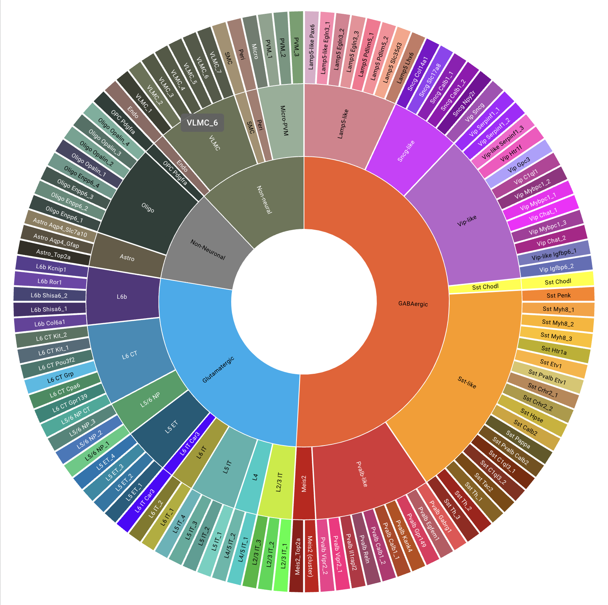

```{r, knitr_opts, include=FALSE}
knitr::opts_chunk$set(message = FALSE, warning = FALSE)
```

# Advanced Topics in Single Cell RNA-Seq: Spatial Transcriptomics

This documentation was produced following the workshop in December 2023 to remedy issues with the documentation used at the time. An accompanying recording of a documentation walk-through will be made available to December 2023 registrants.

## Workspace set-up

A number of libraries are required for proper function of this documentation including Seurat, Rfast2, and spacexr for the analysis, ggplot2, viridis, and patchwork for visualizations, and knitr for formatting.

```{r, libraries}
if (!any(rownames(installed.packages()) == "knitr")){
  BiocManager::install("knitr")
}
if (!any(rownames(installed.packages()) == "Seurat")){
  BiocManager::install("Seurat")
}
if (!any(rownames(installed.packages()) == "Rfast2")){
  BiocManager::install("Rfast2")
}
if (!any(rownames(installed.packages()) == "hdf5r")){
  BiocManager::install("hdf5r")
}
if (!any(rownames(installed.packages()) == "Matrix")){
  BiocManager::install("Matrix")
}
if (!any(rownames(installed.packages()) == "ggplot2")){
  BiocManager::install("ggplot2")
}
if (!any(rownames(installed.packages()) == "viridis")){
  BiocManager::install("viridis")
}
if (!any(rownames(installed.packages()) == "patchwork")){
  BiocManager::install("patchwork")
}
if(!any(rownames(installed.packages()) == "devtools")) {
  install.packages("devtools")
}
if(!any(rownames(installed.packages()) == "spacexr")) {
  devtools::install_github("dmcable/spacexr", build_vignettes = FALSE)
}
library(knitr)
library(Seurat)
library(ggplot2)
library(viridis)
library(patchwork)
library(spacexr)
```

Download the Space Ranger output from tadpole to your working directory with the code below. I suggest copying the commands one at a time into a working terminal (e.g. the "Terminal" tab of RStudio) instead of running the chunk. Don't forget to replace "username" with your username!

```{bash, download_h5, eval=FALSE}
scp username@tadpole.genomecenter.ucdavis.edu:/share/workshop/Spatial_Workshop/Downloads/data.tar.gz .
tar -xzvf data.tar.gz
```

The data directory downloaded by this command contains one directory for each sample with the necessary output files from Space Ranger. To replicate this structure, you could simply rename the "outs" directory with the sample name. The design.tsv file used to run Space Ranger has been copied to the data directory as well, along with a reference expression data set we will make use of later in the analysis.

```{r, setup}
set.seed(1234)
project.name <- "Mouse Brain Sagittal Sections"
dataset.loc <- "data/"
design <- read.delim(paste0(dataset.loc, "design.tsv"),
                     header = FALSE,
                     col.names = c("sample", "image", "slide", "capture.area"))

experiment.slices <- lapply(c(1:dim(design)[1]), function(i){
  # read in image file
  image = Read10X_Image(paste0(dataset.loc, design$sample[i], "/outs/spatial"))
  # create Seurat object with "Spatial" assay
  sce = Load10X_Spatial(paste0(dataset.loc, design$sample[i], "/outs"),
                        filename = "filtered_feature_bc_matrix.h5",
                        assay = "Spatial",
                        slice = design$sample[i],
                        filter.matrix = TRUE,
                        to.upper = FALSE,
                        image = image)
  sce$orig.ident = design$sample[i]
  # add slide serial number to metadata
  sce = AddMetaData(sce, metadata = design$slide[i], col.name = "slide")
  # add capture area to metadata
  sce = AddMetaData(sce, metadata = design$capture.area[i], col.name = "capture.area")
  # create shorter sample label for visualization
  sce = AddMetaData(sce, metadata = sub("Section_", "", sub("V1_Mouse_Brain_Sagittal_", "", design$sample[i])), col.name = "sample.ident")
  ## rename image to match
  names(sce@images) = sub("Section_", "", sub("V1_Mouse_Brain_Sagittal_", "", design$sample[i]))
  # append sample name to cell barcode
  RenameCells(sce, new.names = paste(sapply(strsplit(Cells(sce), split = "-"), "[[", 1), design$sample[i], sep = "-"))
  })

# merge matrices into a single object for QC, normalization, scaling, etc
experiment.merged <- merge(experiment.slices[[1]], experiment.slices[2:4])
experiment.merged <- JoinLayers(experiment.merged)

#tidy workspace
rm(experiment.slices)

experiment.merged
```

## QA/QC

### Custom metrics

In many tissues, a high proportion of UMIs corresponding to mitochondrial transcripts is an indicator of poor viability. However, in an energy intensive tissue, high expression may be typical. In this case, a high percent mitochondrial reads is typical of the cells, making percent mitochondrial an inappropriate filtering criterion for this data.

```{r, percent.mito}
experiment.merged$percent.mito <- PercentageFeatureSet(experiment.merged,
                                                       pattern = "^mt-")
```

### Spatial plots

Indeed, overlaying the per-spot values for UMIs, gene count, and percent mitochondrial onto the slice images reveals a clear relationship between these features and the tissue structures.

```{r, per_spot_vis}
SpatialFeaturePlot(experiment.merged, "nCount_Spatial")
SpatialFeaturePlot(experiment.merged, "nFeature_Spatial")
SpatialFeaturePlot(experiment.merged, "percent.mito")
```

The legends and titles of figures can become compressed as the number of images Seurat is tiling increases. To view a single slice, use the "images" argument of the SpatialFeaturePlot function.

```{r, per_spot_vis_single}
SpatialFeaturePlot(experiment.merged, "percent.mito", images = c("Posterior_1", "Posterior_2"))
```

### Ridge plots

```{r, RidgePlot}
RidgePlot(experiment.merged,
          features = "nCount_Spatial",
          group.by = "sample.ident") +
  guides(fill = "none") +
  scale_fill_viridis_d()
RidgePlot(experiment.merged,
          features = "nFeature_Spatial",
          group.by = "sample.ident") +
  guides(fill = "none") +
  scale_fill_viridis_d()
RidgePlot(experiment.merged,
          features = "percent.mito",
          group.by = "sample.ident") +
  guides(fill = "none") +
  scale_fill_viridis_d()
```

### Scatter plots

```{r, FeatureScatter}
FeatureScatter(experiment.merged,
               feature1 = "nCount_Spatial",
               feature2 = "nFeature_Spatial",
               group.by = "sample.ident",
               shuffle = TRUE) +
  scale_color_viridis_d()
FeatureScatter(experiment.merged,
               feature1 = "nCount_Spatial",
               feature2 = "percent.mito",
               group.by = "sample.ident",
               shuffle = TRUE) +
  scale_color_viridis_d()
```

### Filtering

This workflow uses the filtered_feature_bc_matrix.h5 file, which contains UMI counts per gene from each spot identified as underneath tissue by Space Ranger. The automatic tissue detection removes the majority of empty spots, however, visual artifacts or unsuccessful permeablization can result in spots with no (or very low) UMIs. The inclusion of zero-count spots interferes with normalization.

Unlike in single cell experiments, the presence of multiplets is not a concern; Visium experiments generally have multiple cells per spot, though the number varies from tissue to tissue.

In order to ensure that no empty spots are incorporated, we will remove any spots with fewer than 200 genes detected.

```{r, filter}
experiment.merged
experiment.merged <- subset(experiment.merged, nFeature_Spatial >= 200)
experiment.merged
```
As only a small number of spots are removed, we will not reproduce the QC plots using the filtered data.

## Analysis

### Transform
```{r, SCT}
experiment.merged <- SCTransform(experiment.merged,
                                 assay = "Spatial",
                                 verbose = FALSE)
```

### PCA
```{r, PCA}
experiment.merged <- RunPCA(experiment.merged,
                            assay = "SCT",
                            npcs = 50,
                            verbose = FALSE)
```

### UMAP
```{r, UMAP}
experiment.merged <- RunUMAP(experiment.merged,
                             reduction = "pca",
                             dims = 1:30,
                             verbose = FALSE)
DimPlot(experiment.merged,
        reduction = "umap",
        group.by = "sample.ident",
        shuffle = TRUE) +
  scale_color_viridis_d()

saveRDS(experiment.merged, file = "experiment.merged_UMAP.rds")
```

### Integrate

In this experiment, all four slices were located on the same slide, eliminating the most prominent source of batch variation. In larger Visium experiments, this may not be possible. When samples are spread across two or more slides, the effect of slide to slide variation can be mitigated with integration.

This code is provided as an example. For the remainder of the workshop, the un-integrated data will be used.

```{r, harmony}
experiment.harmony <- experiment.merged
DefaultAssay(experiment.harmony) <- "Spatial"
experiment.harmony@assays$SCT <- NULL
experiment.harmony@assays$Spatial <- split(experiment.harmony@assays$Spatial,
                                           f = experiment.harmony$sample.ident) # for real batch correction, use "slide"
experiment.harmony <- NormalizeData(experiment.harmony)
use.features <- rownames(experiment.merged)[rowSums(experiment.merged@assays$Spatial@layers$counts) >= 1]
experiment.harmony <- ScaleData(experiment.harmony, features = use.features)
experiment.harmony <- RunPCA(experiment.harmony, features = use.features)
experiment.harmony <- IntegrateLayers(object = experiment.harmony,
                                      method = "HarmonyIntegration",
                                      orig.reduction = "pca",
                                      new.reduction = "harmony",
                                      features = use.features,
                                      verbose = FALSE)
experiment.harmony <- RunUMAP(experiment.harmony,
                              reduction = "harmony",
                              dims = 1:50,
                              verbose = FALSE)
p1 <- DimPlot(experiment.harmony,
              reduction = "umap",
              group.by = "sample.ident",
              shuffle = TRUE) +
  scale_color_viridis_d() +
  ggtitle("Integrated")
p2 <- DimPlot(experiment.merged,
              reduction = "umap",
              group.by = "sample.ident",
              shuffle = TRUE) +
  scale_color_viridis_d() +
  ggtitle("Uncorrected")
p1 + p2
rm(use.features, experiment.harmony, p1, p2)
```

Clustering and visualizations may be performed on the integrated data, but for differential expression analysis, the layers should be re-joined, and the uncorrected data used.

Running Harmony does not appear to have altered the UMAP much. Though it has changed, the overall relationship between points is quite similar before and after batch correction. For an example of Harmony results demonstrating a true batch correction, see [this 10x-provided vignette](https://www.10xgenomics.com/resources/analysis-guides/correcting-batch-effects-in-visium-data).

### Cluster

```{r, cluster}
experiment.merged <- FindNeighbors(experiment.merged,
                                   reduction = "pca",
                                   verbose = FALSE)
experiment.merged <- FindClusters(experiment.merged,
                                  resolution = seq(from = 0.15, to = 0.6, by = 0.15),
                                  verbose = FALSE)
lapply(grep("snn", colnames(experiment.merged@meta.data), value = TRUE),
       function(res){
         DimPlot(experiment.merged,
                 reduction = "umap",
                 group.by = res,
                 shuffle = TRUE) +
           scale_color_viridis_d(option = "turbo")
       })
# merged object visualization is too small, plus color scale change applies only to final image
SpatialDimPlot(experiment.merged,
               group.by = "SCT_snn_res.0.3") +
  scale_fill_viridis_d(option = "turbo")
# create palette
cluster.palette <- viridis(length(levels(experiment.merged$SCT_snn_res.0.3)), option = "turbo")
names(cluster.palette) <- levels(experiment.merged$SCT_snn_res.0.3)
# lapply to plot each slice individually
p <- lapply(names(experiment.merged@images), function(image){
  SpatialDimPlot(experiment.merged,
                 group.by = "SCT_snn_res.0.3",
                 images = c(image)) +
    scale_fill_manual(values = cluster.palette) +
    ggtitle(paste(image))
})
p[[1]] + p[[3]]
p[[2]] + p[[4]]
rm(p)
# save object
saveRDS(experiment.merged, "experiment.merged_clusters.rds")
```

### Find spatially variable genes

Spatially variable features are genes for which the spatial coordinates (i.e. location within the tissue) of spots explain expression level. In a layered tissue like the mouse brain samples we are using, spatial coordinates correspond closely to tissue structures and cell types. In other tissues, this may not be the case.

FindSpatiallyVariableFeatures should only be run on spots belonging to the same slice, as calculating spatial variability across discontinuous spots will produce artifacts and errors. Expression profiles vary widely across the mouse brain sagittal slices used in this experiment. To identify variation of interest (and run the algorithm in a timely manner), we can select one or more groups of spots corresponding to anatomical structures to interrogate for spatially variable features.

Here we select cluster 3, which appears to correspond roughly to the striatum (in blue, below).


```{r, SpatiallyVariable}
# subset object to slice and cluster of interest
anterior1.cluster3 <- subset(experiment.merged, sample.ident == "Anterior_1" & SCT_snn_res.0.3 == "3")
# remove extra images
anterior1.cluster3@images[2:4] <- NULL
# find spatially variable features
anterior1.cluster3 <- FindSpatiallyVariableFeatures(anterior1.cluster3,
                                                    assay = "SCT",
                                                    slot = "scale.data",
                                                    features = VariableFeatures(anterior1.cluster3),
                                                    selection.method = "markvariogram")
```

The SVFInfo and SpatiallyVariableFeatures functions, designed to access the slot modified by FindSpatiallyVariableFeatures, are producing errors at the time of writing this documentation, but addressing the slot directly produces results. There are [a number of open issues](https://github.com/satijalab/seurat/issues?q=is%3Aissue+is%3Aopen+findspatiallyvariablefeatures) in the Seurat 5 GitHub repository pertaining to FindSpatiallyVariableFeatures, so I expect that future updates will address the problem.

```{r, top_spatial}
svf.rank <- anterior1.cluster3@assays$SCT@meta.features
svf.rank <- svf.rank[order(svf.rank$markvariogram.spatially.variable.rank),]
svf.rank <- svf.rank[1:length(which(svf.rank$markvariogram.spatially.variable)),]
svf.rank[1:10,]
```

Visualizing the expression with SpatialFeaturePlot can provide a dramatic illustration of variation across the selected region.
```{r, vis_top_spatial_cluster3}
lapply(rownames(svf.rank)[c(1,3,5,8)], function(feature){
    SpatialFeaturePlot(anterior1.cluster3, features = feature, crop = FALSE)
})
```

However, expanding the view to include the entire tissue section reveals that some of the variation appears to be primarily influenced by expression in neighboring regions.
```{r, vis_top_spatial_all}
lapply(rownames(svf.rank)[c(1,3,5,8)], function(feature){
  SpatialFeaturePlot(experiment.merged,
                     features = feature,
                     images = c("Anterior_1", "Anterior_2"))
})
rm(anterior1.cluster3)
```

### Cell type prediction and spot "decomposition"

Each spot on a Visium slide may incorporate one or more cell types, depending on the placement. Under the previous version of Seurat (4.4.0), the recommended method for cell type detection was integration. Instead of attempting to assign a single cell type to each spot, the Seurat 4 integration method calculated a prediction score for each cell type based on the expression profiles from a single cell data set. This methodology is still available (in version 5), but the authors now recommend using [Robust Cell Type Decomposition](https://www.nature.com/articles/s41587-021-00830-w)(RCTD).

The spacexr library installed at the beginning of this session supports RCTD. Here we use the spacexr function SpatialRNA to create an a list of objects (one for each slice) containing counts data and centroid coordinates for each spot.

```{r, create_query}
experiment.slices <- experiment.merged
DefaultAssay(experiment.slices) <- "Spatial"
experiment.slices <- split(experiment.slices, f = experiment.slices$sample.ident)
queries <- lapply(seq_along(Layers(experiment.slices)), function(i){
  coords = GetTissueCoordinates(experiment.slices, image = names(experiment.slices@images)[i], which = "centroids")
  counts = GetAssayData(experiment.slices, assay = "Spatial", layer = Layers(experiment.slices)[i])
  SpatialRNA(coords = coords, counts = counts, nUMI = colSums(counts))
})
```

The Allen Brain Atlas has a comprehensive collection of [publicly available single cell data sets](https://portal.brain-map.org/atlases-and-data/rnaseq). For this experiment, we have selected a small number of cells corresponding to cell types present in the slices. This sub-setting was necessary in order to create a reference set that will run quickly with limited resources. The Seurat object containing the atlas was created for a previous workshop under Seurat 4 and must be updated to Seurat 5 prior to continuing with the workflow. The spacexr reference is then created from the atlas object.

```{r, create_reference}
atlas <- readRDS(paste(dataset.loc, "allen_subset_atlas.rds", sep = "/"))
atlas <- UpdateSeuratObject(atlas)
# RCTD requires a minimum of 25 cells per type. drop types with fewer cells.
atlas <- atlas[,!(atlas$cell_type_accession_label %in% names(which(table(atlas$cell_type_accession_label) < 25)))]
# alias labels (most readable) contain some special characters. create conversion table
atlas.labels <- atlas@meta.data[!duplicated(atlas$cell_type_alias_label),c("cell_type_accession_label", "cell_type_alias_label")]
rownames(atlas.labels) <- NULL
reference <- Reference(counts = GetAssayData(atlas, assay = "RNA", layer = "counts"),
                       cell_types = as.factor(atlas$cell_type_accession_label),
                       nUMI = atlas$nCount_RNA)
```

Once both the query (Visium) and reference (atlas) objects have been created, we can run the decomposition itself. This is more computationally intensive than earlier steps and can be run on more than one core to improve speed. The code below

```{r, RCTD}
RCTD.list <- lapply(queries, function(query){
  RCTD = create.RCTD(query, reference, max_cores = 8)
  RCTD = run.RCTD(RCTD, doublet_mode = "doublet")
})
```

The complex RCTD object created contains cell type predictions within the results slot, in a data.frame called "results_df." To add the predictions to the experiment.merged object, we collect the relevant column from the data.frame and collapse it into a named vector before using the new vector as input to AddMetaData.

```{r, predictions}
# add results from each slice to metadata table
annotations.list <- lapply(RCTD.list, function(slice){
  annotations = atlas.labels$cell_type_alias_label[match(slice@results$results_df$first_type, atlas.labels$cell_type_accession_label)]
  names(annotations) = rownames(slice@results$results_df)
  annotations
})
experiment.merged <- AddMetaData(experiment.merged,
                                 unlist(annotations.list),
                                 col.name = "predicted.celltype")

length(is.na(experiment.merged$predicted.celltype))
table(experiment.merged$predicted.celltype)
# establish color palette
celltype.palette <- viridis(dim(atlas.labels)[1], option = "mako")
names(celltype.palette) <- atlas.labels$cell_type_alias_label
# Spatial plot
p <- lapply(names(experiment.merged@images), function(slice){
  SpatialDimPlot(experiment.merged,
                 group.by = "predicted.celltype",
                 images = c(slice)) +
    scale_fill_manual(values = celltype.palette)
})
p[[1]] + p[[3]]
p[[2]] + p[[4]]
# UMAP
DimPlot(experiment.merged,
        group.by = "predicted.celltype",
        shuffle = TRUE) +
  scale_color_manual(values = celltype.palette)
```

Let's take a few minutes to explore the results of the cell type prediction. The [Cell Type Knowledge Explorer](https://knowledge.brain-map.org/celltypes/CCN202002013) offers a look at the types described by the alias label. Click on a wedge in the plot to go to information about the cell type(s) highlighted.



Using ggplot2, we can generate a custom plot to illustrate the cell type composition of each cluster.

```{r, cluster_composition}
colnames(experiment.merged@meta.data)
ggplot(data = experiment.merged@meta.data, mapping = aes(x = SCT_snn_res.0.3, fill = predicted.celltype)) + geom_bar() + scale_fill_manual(values = celltype.palette) + theme_classic()
```

Cluster 3, which we selected for the spatially variable features analysis, appears to be enriched in cell types 167_L2/3 IT CTX and 228_L6 IT CTX. Use the table function to get exact counts.

Does the expression of the top spatially variable genes from cluster three differ between the cell types?

```{r, tnnt1_vln_cluster3}
lapply(rownames(svf.rank)[c(1,3,5,8)], function(feature){
  VlnPlot(experiment.merged,
          group.by = "predicted.celltype",
          idents = "3",
          features = feature) +
    scale_fill_manual(values = celltype.palette)
})
```

Does the relationship between predicted cell type and Tnnt1 expression hold up outside of cluster 3?

```{r, tnnt1_vln_all}
VlnPlot(experiment.merged,
        group.by = "predicted.celltype",
        features = "Tnnt1") +
  scale_fill_manual(values = celltype.palette)
```
### Build "niches"

Seurat 5 introduces the concept of "niches," which organize cells by both cell type composition and spatial adjacency. While the clustering performed earlier relies on a network constructed on transcriptional similarity (via the PCA dimensionality reduction), niche-building uses a network describing the cell type identities of each spot's *spatial* neighbors. Then, k-means clustering identifies spots that have similar neighbors as members of the same "spatial niche."

```{r, BuildNicheAssay}

```

In addition to the gene expression data, we can plot relationships between continuous metadata and cluster, niche, or cell type assignment.

```{r}
VlnPlot(experiment.merged,
        group.by = "predicted.celltype",
        features = "percent.mito") +
  scale_fill_manual(values = celltype.palette)
VlnPlot(experiment.merged,
        group.by = "SCT_snn_res.0.3",
        features = "percent.mito") +
  scale_fill_manual(values = cluster.palette)
```

# Session information

```{r}
sessionInfo()
```
