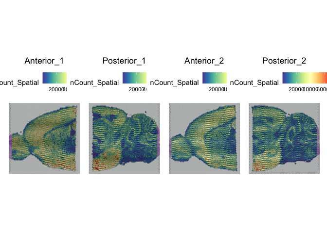
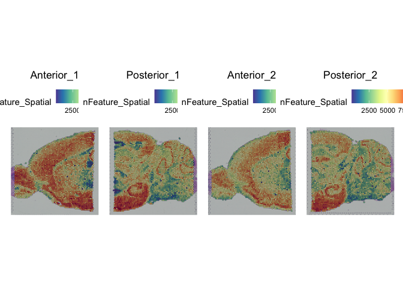
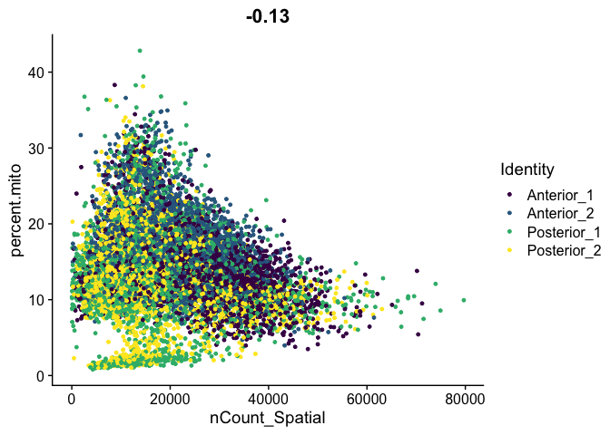
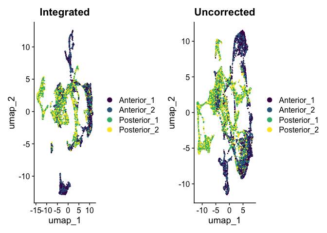
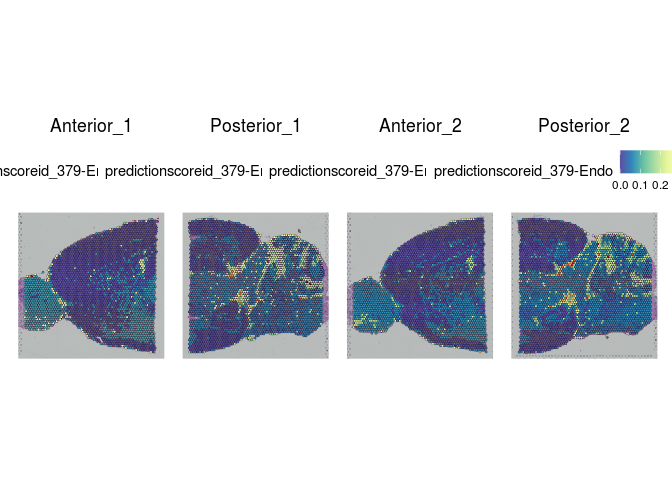

# Load libraries


```r
if (!any(rownames(installed.packages()) == "knitr")){
  BiocManager::install("knitr")
}
if (!any(rownames(installed.packages()) == "Seurat")){
  BiocManager::install("Seurat")
}
if (!any(rownames(installed.packages()) == "hdf5r")){
  BiocManager::install("hdf5r")
}
if (!any(rownames(installed.packages()) == "harmony")){
  BiocManager::install("harmony")
}
if (!any(rownames(installed.packages()) == "Matrix")){
  BiocManager::install("Matrix")
}
if (!any(rownames(installed.packages()) == "ggplot2")){
  BiocManager::install("ggplot2")
}
if (!any(rownames(installed.packages()) == "viridis")){
  BiocManager::install("viridis")
}
if (!any(rownames(installed.packages()) == "patchwork")){
  BiocManager::install("patchwork")
}
library(knitr)
library(Seurat)
library(harmony)
library(ggplot2)
library(viridis)
library(patchwork)
```

# Experiment set-up

While we don't have the resources available to complete all of the Space Ranger alignments for each sample during the workshop, we hope you will take the opportunity to re-run Space Ranger on your own. Until then, you can download the output from tadpole with the command below. Don't forget to replace "username" with your username!


```bash
scp -r username@tadpole.genomecenter.ucdavis.edu:/share/workshop/spatial_workshop/data_analysis/data .
```

The data directory downloaded by this command contains one directory for each sample with the necessary output files from Space Ranger. To replicate this structure, you could simply rename the "outs" directory with the sample name.


```r
project.name <- "Mouse Brain Sagittal Sections"
dataset.loc <- "data/"
design <- read.delim(paste0(dataset.loc, "design.tsv"))
experiment.slices <- lapply(design$sample, function(sample){
  # read in image file
  image = Read10X_Image(paste0(dataset.loc, sample, "/outs/spatial"))
  # create Seurat object with "Spatial" assay
  sce = Load10X_Spatial(paste0(dataset.loc, sample, "/outs"),
                        filename = "filtered_feature_bc_matrix.h5",
                        assay = "Spatial",
                        slice = sample,
                        filter.matrix = TRUE,
                        to.upper = FALSE,
                        image = image)
  sce = SetIdent(sce, value = sample)
  # append sample name to cell barcode
  RenameCells(sce, new.names = paste(sapply(strsplit(Cells(sce), split = "-"), "[[", 1), sample, sep = "-"))
  })
# merge matrices into a single object for QC, normalization, scaling, etc
experiment.merged <- merge(experiment.slices[[1]], experiment.slices[2:4])
# add design metadata
rownames(design) <- design$sample
slide <- design[sapply(strsplit(Cells(experiment.merged), "-"), "[[", 2), "slide"]
capture.area <- design[sapply(strsplit(Cells(experiment.merged), "-"), "[[", 2), "capture.area"]
experiment.merged <- AddMetaData(experiment.merged,
                                 metadata = slide,
                                 col.name = "slide")
experiment.merged <- AddMetaData(experiment.merged,
                                 metadata = capture.area,
                                 col.name = "capture.area")
# rename samples to create shorter labels for visualizations
experiment.merged$orig.ident <- 
gsub("Section_", "", gsub("V1_Mouse_Brain_Sagittal_", "", Idents(experiment.merged)))
names(experiment.merged@images) <- gsub("Section_", "", gsub("V1_Mouse_Brain_Sagittal_", "", names(experiment.merged@images)))
# slices object will be used only for FindSpatiallyVariableFeatures
rm(project.name, experiment.slices, slide, capture.area)
```

# QA/QC

## Custom metrics

In many tissues, a high proportion of UMIs corresponding to mitochondrial transcripts is an indicator of poor viability. However, in an energy intensive tissue, high expression may be typical. In this case, a high percent mitochondrial reads is typical of the cells, making percent mitochondrial an inappropriate filtering criterion for this data.


```r
experiment.merged$percent.mito <- PercentageFeatureSet(experiment.merged,
                                                       pattern = "^mt-")
```

## Spatial plots

Indeed, overlaying the per-spot values for UMIs, gene count, and percent mitochondrial onto the slice images reveals a clear relationship between these features and the tissue structures.


```r
SpatialFeaturePlot(experiment.merged, "nCount_Spatial")
```

<!-- -->

```r
SpatialFeaturePlot(experiment.merged, "nFeature_Spatial")
```

<!-- -->

```r
SpatialFeaturePlot(experiment.merged, "percent.mito")
```

<!-- -->

The legends and titles of figures can become compressed as the number of images Seurat is tiling increases. To view a single slice, use the "images" argument of the SpatialFeaturePlot function.


```r
SpatialFeaturePlot(experiment.merged, "percent.mito", images = c("Posterior_1"))
```

<!-- -->

## Ridge plots


```r
RidgePlot(experiment.merged,
          features = "nCount_Spatial",
          group.by = "orig.ident") +
  guides(fill = "none") +
  scale_fill_viridis_d()
```

<!-- -->

```r
RidgePlot(experiment.merged,
          features = "nFeature_Spatial",
          group.by = "orig.ident") +
  guides(fill = "none") +
  scale_fill_viridis_d()
```

<!-- -->

```r
RidgePlot(experiment.merged,
          features = "percent.mito",
          group.by = "orig.ident") +
  guides(fill = "none") +
  scale_fill_viridis_d()
```

<!-- -->

## Scatter plots


```r
FeatureScatter(experiment.merged,
               feature1 = "nCount_Spatial",
               feature2 = "nFeature_Spatial",
               group.by = "orig.ident",
               shuffle = TRUE) +
  scale_color_viridis_d()
```

<!-- -->

```r
FeatureScatter(experiment.merged,
               feature1 = "nCount_Spatial",
               feature2 = "percent.mito",
               group.by = "orig.ident",
               shuffle = TRUE) +
  scale_color_viridis_d()
```

<!-- -->

## Filtering

This workflow uses the filtered_feature_bc_matrix.h5 file, which contains UMI counts per gene from each spot identified as underneath tissue by Space Ranger. The automatic tissue detection removes the majority of empty spots, however, visual artifacts or unsuccessful permeablization can result in spots with no (or very low) UMIs. The inclusion of zero-count spots interferes with normalization.

Unlike in single cell experiments, the presence of multiplets is not a concern; Visium experiments generally have multiple cells per spot, though the number varies from tissue to tissue.

In order to ensure that no empty spots are incorporated, we will remove any spots with fewer than 200 genes detected.


```r
experiment.merged <- subset(experiment.merged, nFeature_Spatial >= 200)
experiment.merged
```

```
## An object of class Seurat 
## 32285 features across 12146 samples within 1 assay 
## Active assay: Spatial (32285 features, 0 variable features)
##  4 images present: Anterior_1, Posterior_1, Anterior_2, Posterior_2
```

# Analysis


```r
# transform
experiment.merged <- SCTransform(experiment.merged,
                                 assay = "Spatial",
                                 verbose = FALSE)
# PCA
experiment.merged <- RunPCA(experiment.merged,
                            assay = "SCT",
                            npcs = 50,
                            verbose = FALSE)
# UMAP
experiment.merged <- RunUMAP(experiment.merged,
                             reduction = "pca",
                             dims = 1:30,
                             verbose = FALSE)
DimPlot(experiment.merged,
        reduction = "umap",
        group.by = "orig.ident",
        shuffle = TRUE) +
  scale_color_viridis_d()
```

<!-- -->

## Prepare for detection of spatially variable genes

Spatially variable features are genes for which the spatial coordinates (i.e. location within the tissue) of spots explains expression level. In a layered tissue like the mouse brain samples we are using, spatial coordinates correspond closely to tissue structures and cell types. In other tissues, this may not be the case.

Seurat's FindSpatiallyVariableFeatures function takes a very long time to run. In order to speed up the process, we will divide our merged object by slice, save each slice as a separate object, and run the function in parallel on the cluster while we continue with the rest of the data analysis.


```r
# split object
experiment.slices <- SplitObject(experiment.merged, split.by = "orig.ident")
# remove extra images
experiment.slices <- lapply(experiment.slices, function(sce) {
  sce@images[names(sce@images) != sce$orig.ident[1]] = NULL
  sce
})
# save objects for submission to slurm
lapply(names(experiment.slices), function(sample){
  saveRDS(experiment.slices[[sample]], paste0(sample, ".rds"))
})
```

```
## [[1]]
## NULL
## 
## [[2]]
## NULL
## 
## [[3]]
## NULL
## 
## [[4]]
## NULL
```

Upload the RDS objects to tadpole.


```bash
scp *.rds username@tadpole.genomecenter.ucdavis.edu:/share/workshop/spatial_workshop/username/02-Seurat/
```

Then **on the cluster**, run the following:


```bash
cd /share/workshop/spatial_workshop/$USER/scripts
sbatch 02-Seurat.slurm
```

The R code below is contained in the script FindSpatiallyVariable.R, which is run by 02-Seurat.slurm. Do not run this code on your laptop during the workshop, as it will take a long time to complete. Instead, launch a batch job on the cluster, then proceed to the next section.


```r
# set sample
sample <- commandArgs(trailingOnly=TRUE)[1]
# read data
sce <- readRDS(paste0("../02-Seurat/", sample, ".rds"))
# identify spatially variable features
sce <- FindSpatiallyVariableFeatures(sce, assay = "SCT", features = VariableFeatures(sce), selection.method = "markvariogram")
# save object
saveRDS(sce, paste0("../02-Seurat/", sample, "_spatiallyVariableFeatures.rds"))
```

## Batch effect correction with RunHarmony

In this experiment, all four slices were located on the same slide, eliminating the most prominent source of batch variation. In larger Visium experiments, this may not be possible. When samples are spread across two or more slides, the effect of slide to slide variation can be mitigated with Harmony batch correction.

This code is provided as an example. For the remainder of the workshop, the uncorrected data will be used.


```r
experiment.harmony <- RunHarmony(experiment.merged,
                                group.by.vars = "orig.ident", # for real batch correction use "slide"
                                assay.use = "SCT",
                                verbose = FALSE)
experiment.harmony <- RunUMAP(experiment.harmony,
                             reduction = "harmony",
                             dims = 1:50,
                             verbose = FALSE)
DimPlot(experiment.harmony,
        reduction = "umap",
        group.by = "orig.ident",
        shuffle = TRUE) +
  scale_color_viridis_d()
```

<!-- -->

```r
rm(experiment.harmony)
```

Running Harmony does not appear to have altered the UMAP much. Though it has changed, the overall relationship between points is quite similar before and after batch correction. For an example of Harmony results demonstrating a true batch correction, see [this 10x-provided vignette](https://www.10xgenomics.com/resources/analysis-guides/correcting-batch-effects-in-visium-data).

## Cell type prediction and "deconvolution"

Each spot on a Visium slide may incorporate one or more cell types, depending on the placement. Instead of attempting to assign a single cell type to each spot, the Seurat integration method calculates a prediction score for each cell type based on the expression profiles from a single cell dataset.

The Allen Brain Atlas has a comprehensive collection of [publicly available single cell data sets](https://portal.brain-map.org/atlases-and-data/rnaseq). For this experiment, we have selected a small number of cells corresponding to cell types present in the slices. This subsetting was necessary in order to create a reference set that will run quickly with limited resources. 


```r
atlas <- readRDS(paste(dataset.loc, "allen_subset_atlas.rds", sep = "/"))
atlas <- SCTransform(atlas, verbose = FALSE)
atlas <- RunPCA(atlas, verbose = FALSE)
atlas <- RunUMAP(atlas, dims = 1:30, verbose = FALSE)
anchors <- FindTransferAnchors(reference = atlas,
                               query = experiment.merged,
                               normalization.method = "SCT")
predictions <- TransferData(anchorset = anchors,
                            refdata = atlas$cell_type_alias_label,
                            prediction.assay = TRUE,
                            weight.reduction = experiment.merged[["pca"]],
                            dims = 1:30)
experiment.merged[["predictions"]] <- predictions
cell.types <- rownames(GetAssayData(experiment.merged, assay = "predictions"))
cell.types
```

```
##  [1] "228-L6 IT CTX"    "287-L6 CT CTX"    "189-L4/5 IT CTX"  "363-DG"          
##  [5] "98-Sst"           "82-Sst"           "167-L2/3 IT CTX"  "288-L6 CT CTX"   
##  [9] "204-L5/6 IT CTX"  "64-Sst Chodl"     "91-Sst"           "293-L6 CT CTX"   
## [13] "99-Sst"           "114-Pvalb"        "238-Car3"         "12-Lamp5"        
## [17] "96-Sst"           "200-L5 IT CTX"    "379-Endo"         "348-CA1-do"      
## [21] "88-Sst"           "100-Sst"          "83-Sst"           "115-Pvalb"       
## [25] "376-Astro"        "387-Micro-PVM"    "112-Pvalb"        "375-Oligo"       
## [29] "161-L2/3 IT ENTl" "113-Pvalb"        "384-VLMC"         "360-CA2-IG-FC"   
## [33] "378-Astro"        "max"
```

```r
# visualize cell type predictions on slices
lapply(cell.types[c(1, 7, 19, 25, 26, 28, 32)], function(id){
  SpatialFeaturePlot(experiment.merged, id)
})
```

```
## [[1]]
```

<!-- -->

```
## 
## [[2]]
```

<!-- -->

```
## 
## [[3]]
```

<!-- -->

```
## 
## [[4]]
```

<!-- -->

```
## 
## [[5]]
```

<!-- -->

```
## 
## [[6]]
```

<!-- -->

```
## 
## [[7]]
```

<!-- -->

```r
rm(atlas, anchors, predictions)
```

Take a few minutes to explore the results of the cell type prediction. A graphical view of the Allen Atlas is available [here](https://celltypes.brain-map.org/rnaseq/mouse_ctx-hpf_10x?selectedVisualization=Heatmap&colorByFeature=Cell+Type&colorByFeatureValue=Gad1).

## Clustering

If a reference single cell experiment is incomplete, not available, or does not offer sufficient detail, unsupervised clustering provides an alternative method of grouping spots together into experimentally relevant units.

Clustering in a spatial experiment is performed in the same way as clustering in a single cell experiment. The following code produces clusters at a series of resolutions. An appropriate clustering resolution for an experiment is one that groups the spots into usable, relevant clusters. Clusters may be merged or broken down into higher-resolution components as needed.

For this experiment, the FindNeighbors function is using the PCA as input. If batch correction were necessary in this experiment, we would use "harmony" as the reduction argument instead.


```r
experiment.merged <- FindNeighbors(experiment.merged,
                                   reduction = "pca",
                                   verbose = FALSE)
experiment.merged <- FindClusters(experiment.merged,
                                  resolution = seq(0.2, 1, 0.2),
                                  verbose = FALSE)
lapply(grep("snn", colnames(experiment.merged@meta.data), value = TRUE),
       function(res){
         DimPlot(experiment.merged,
                 reduction = "umap",
                 group.by = res,
                 shuffle = TRUE) +
           scale_color_viridis_d(option = "turbo")
       })
```

```
## [[1]]
```

<!-- -->

```
## 
## [[2]]
```

<!-- -->

```
## 
## [[3]]
```

<!-- -->

```
## 
## [[4]]
```

<!-- -->

```
## 
## [[5]]
```

<!-- -->

In some cases, the behavior of the visualization functions in a multi-slice merged object results in very small or otherwise illegible images. To get around this, simply split the merged object by slice before visualizing.


```r
# merged object visualization is too small
SpatialDimPlot(experiment.merged,
               group.by = "SCT_snn_res.0.2") +
  scale_fill_viridis_d(option = "turbo")
```

<!-- -->

```r
# split object
experiment.slices <- SplitObject(experiment.merged, split.by = "orig.ident")
# remove extra images
experiment.slices <- lapply(experiment.slices, function(sce) {
  sce@images[names(sce@images) != sce$orig.ident[1]] = NULL
  sce
})
# visualize on slice
## palette is unstable if not all clusters are present on each slice
res.0.2.palette <- viridis(length(levels(experiment.merged$SCT_snn_res.0.2)),
                           option = "turbo")
names(res.0.2.palette) <- levels(experiment.merged$SCT_snn_res.0.2)
lapply(experiment.slices, function(slice) {
  SpatialDimPlot(slice,
                 group.by = "SCT_snn_res.0.2",
                 label = TRUE,
                 label.size = 3) +
    scale_fill_manual(values = res.0.2.palette) +
    guides(fill = "none")
})
```

```
## $Anterior_1
```

<!-- -->

```
## 
## $Posterior_1
```

<!-- -->

```
## 
## $Anterior_2
```

<!-- -->

```
## 
## $Posterior_2
```

<!-- -->

```r
rm(experiment.slices)
```

Once clustering is complete, the cluster identities at each resolution are available as categorical variables in the metadata table. The code below visualizes the relationship between cluster membership and cell type prediction scores.


```r
lapply(cell.types[c(1, 7, 19, 25, 26, 28, 32)], function(id){
  VlnPlot(experiment.merged,
          features = id,
          group.by = "SCT_snn_res.0.2",
          pt.size = 0) +
    scale_fill_viridis_d(option = "turbo") +
    guides(fill = "none") +
    labs(x = "Cluster",
         y = "Prediction Score",
         title = sub("predictionscoreid_", "", id))
})
```

```
## [[1]]
```

<!-- -->

```
## 
## [[2]]
```

<!-- -->

```
## 
## [[3]]
```

<!-- -->

```
## 
## [[4]]
```

<!-- -->

```
## 
## [[5]]
```

<!-- -->

```
## 
## [[6]]
```

<!-- -->

```
## 
## [[7]]
```

<!-- -->

Take a few minutes to play around with the available metadata and visualization functions to explore relationships of interest in the data.


```r
# unlike VlnPlot and spatial plots, FeatureScatter has issues with the special characters contained in the cell type names
lapply(cell.types[c(19, 25, 26, 28, 32)], function(id){
  FeatureScatter(experiment.merged,
                 feature1 = id,
                 feature2 = "percent.mito",
                 group.by = "orig.ident",
                 shuffle = TRUE) +
    scale_color_viridis_d() +
    labs(x = sub("predictionscoreid_", "", id),
         y = "Percent Mitochondrial")
})
```

```
## [[1]]
```

<!-- -->

```
## 
## [[2]]
```

<!-- -->

```
## 
## [[3]]
```

<!-- -->

```
## 
## [[4]]
```

<!-- -->

```
## 
## [[5]]
```

<!-- -->

## Spatially variable features

Hopefully, at this point, your slurm job will have completed. Run the following code to download the FindSpatiallyVariableFeatures output, replacing "username" with your own username.


```bash
scp username@tadpole.genomecenter.ucdavis.edu:share/workshop/spatial_workshop/username/02-Seurat/*_spatiallyVariableFeatures.rds .
```

If your slurm array is not yet complete, you can download the finished objects from the shared downloads folders instead.


```bash
scp username@tadpole.genomecenter.ucdavis.edu:/share/workshop/spatial_workshop/data_analysis/R/*_spatiallyVariableFeatures.rds .
```

The results of FindSpatiallyVariableFeatures can be accessed with the SVFInfo (produces a table of scores) or SpatiallyVariableFeatures (produces a list of genes, in order of decreasing spatial variability).


```r
experiment.slices <- lapply(unique(experiment.merged$orig.ident), function(sample){
  readRDS(paste0(sample, "_spatiallyVariableFeatures.rds"))
})
names(experiment.slices) <- unique(experiment.merged$orig.ident)
lapply(experiment.slices, function(slice){
  SpatialFeaturePlot(slice, features = SpatiallyVariableFeatures(slice)[1:5])
})
```

```
## $Anterior_1
```

<!-- -->

```
## 
## $Posterior_1
```

<!-- -->

```
## 
## $Anterior_2
```

<!-- -->

```
## 
## $Posterior_2
```

<!-- -->

# Session information


```r
sessionInfo()
```

```
## R version 4.1.0 (2021-05-18)
## Platform: x86_64-pc-linux-gnu (64-bit)
## Running under: Ubuntu 16.04.6 LTS
## 
## Matrix products: default
## BLAS:   /afs/genomecenter.ucdavis.edu/software/R/4.1.0/lssc0-linux/lib/R/lib/libRblas.so
## LAPACK: /afs/genomecenter.ucdavis.edu/software/R/4.1.0/lssc0-linux/lib/R/lib/libRlapack.so
## 
## locale:
##  [1] LC_CTYPE=en_US       LC_NUMERIC=C         LC_TIME=en_US       
##  [4] LC_COLLATE=en_US     LC_MONETARY=en_US    LC_MESSAGES=en_US   
##  [7] LC_PAPER=en_US       LC_NAME=C            LC_ADDRESS=C        
## [10] LC_TELEPHONE=C       LC_MEASUREMENT=en_US LC_IDENTIFICATION=C 
## 
## attached base packages:
## [1] stats     graphics  grDevices utils     datasets  methods   base     
## 
## other attached packages:
##  [1] patchwork_1.1.2    viridis_0.6.2      viridisLite_0.4.1  ggplot2_3.3.6     
##  [5] harmony_0.1.1      Rcpp_1.0.9         sp_1.5-1           SeuratObject_4.1.2
##  [9] Seurat_4.2.0       knitr_1.40        
## 
## loaded via a namespace (and not attached):
##   [1] Rtsne_0.16            colorspace_2.0-3      deldir_1.0-6         
##   [4] ellipsis_0.3.2        ggridges_0.5.4        spatstat.data_3.0-0  
##   [7] farver_2.1.1          leiden_0.4.3          listenv_0.8.0        
##  [10] bit64_4.0.5           ggrepel_0.9.2         fansi_1.0.3          
##  [13] codetools_0.2-18      splines_4.1.0         cachem_1.0.6         
##  [16] polyclip_1.10-0       jsonlite_1.8.3        ica_1.0-3            
##  [19] cluster_2.1.4         png_0.1-7             rgeos_0.5-9          
##  [22] uwot_0.1.14           shiny_1.7.3           sctransform_0.3.5    
##  [25] spatstat.sparse_3.0-0 compiler_4.1.0        httr_1.4.4           
##  [28] assertthat_0.2.1      Matrix_1.5-1          fastmap_1.1.0        
##  [31] lazyeval_0.2.2        cli_3.4.1             later_1.3.0          
##  [34] htmltools_0.5.3       tools_4.1.0           igraph_1.3.5         
##  [37] gtable_0.3.1          glue_1.6.2            RANN_2.6.1           
##  [40] reshape2_1.4.4        dplyr_1.0.10          scattermore_0.8      
##  [43] jquerylib_0.1.4       vctrs_0.4.2           nlme_3.1-160         
##  [46] progressr_0.11.0      lmtest_0.9-40         spatstat.random_2.2-0
##  [49] xfun_0.34             stringr_1.4.1         globals_0.16.1       
##  [52] mime_0.12             miniUI_0.1.1.1        lifecycle_1.0.3      
##  [55] irlba_2.3.5.1         goftest_1.2-3         future_1.29.0        
##  [58] MASS_7.3-58.1         zoo_1.8-11            scales_1.2.1         
##  [61] spatstat.core_2.4-4   promises_1.2.0.1      spatstat.utils_3.0-1 
##  [64] parallel_4.1.0        RColorBrewer_1.1-3    yaml_2.3.6           
##  [67] reticulate_1.26       pbapply_1.5-0         gridExtra_2.3        
##  [70] sass_0.4.2            rpart_4.1.16          stringi_1.7.8        
##  [73] highr_0.9             rlang_1.0.6           pkgconfig_2.0.3      
##  [76] matrixStats_0.62.0    evaluate_0.18         lattice_0.20-45      
##  [79] ROCR_1.0-11           purrr_0.3.5           tensor_1.5           
##  [82] labeling_0.4.2        htmlwidgets_1.5.4     bit_4.0.4            
##  [85] cowplot_1.1.1         tidyselect_1.2.0      parallelly_1.32.1    
##  [88] RcppAnnoy_0.0.20      plyr_1.8.6            magrittr_2.0.3       
##  [91] R6_2.5.1              generics_0.1.3        DBI_1.1.3            
##  [94] withr_2.5.0           mgcv_1.8-39           pillar_1.8.1         
##  [97] fitdistrplus_1.1-8    survival_3.4-0        abind_1.4-5          
## [100] tibble_3.1.8          future.apply_1.10.0   crayon_1.5.2         
## [103] hdf5r_1.3.7           KernSmooth_2.23-20    utf8_1.2.2           
## [106] spatstat.geom_2.4-0   plotly_4.10.1         rmarkdown_2.17       
## [109] grid_4.1.0            data.table_1.14.4     digest_0.6.30        
## [112] xtable_1.8-4          tidyr_1.2.1           httpuv_1.6.6         
## [115] munsell_0.5.0         bslib_0.4.1
```
