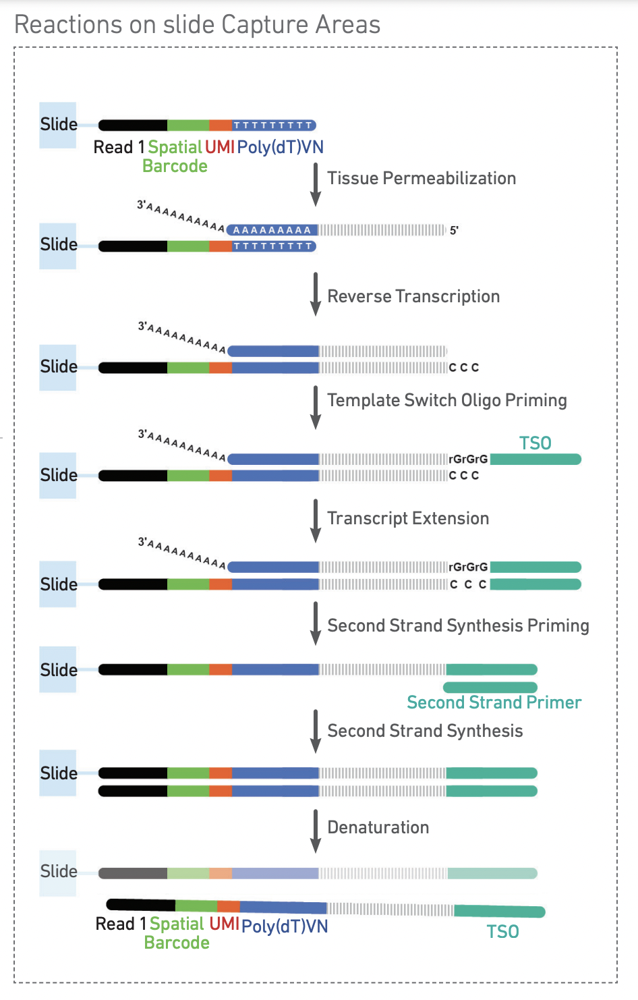
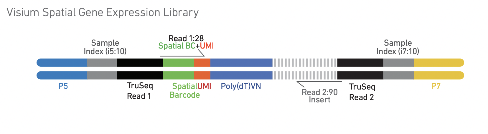

# Generating a Gene Expression Matrix

Most analyses have two stages: data reduction and data analysis.

Analyses of spatial transcriptomics data take as their starting point an __expression matrix__, where each row represents a gene and each column represents a cell or spot. Each entry in the matrix represents the number of reads (proxy for expression level) of a particular gene in a given sample (spot). Because we are working with 10x Genomics data, we will be using the 10x Cell Ranger pipeline to handle the data reduction tasks.

## Visium


The Visium slide captures RNA from tissue slices placed over specialized regions of oligo spots called the capture area. Each of these spots is identified by both a coordinate system describing its location within the capture area, and a unique spatial barcode sequence, analogous to the cell barcode from a single cell or single nuclei experiment.



Each spot is comprised of a group of oligos, each of which includes the spatial barccode, which is the same for every oligo in the spot, and the unique molecular identifier (UMI), which is random, and different for each oligo. Through a series of interactions that take place on the slide, RNA released by tissue permeabilization is therefore barcoded with an identifier corresponding to both the spatial location on the slide, and the identity of the RNA fragment.

After cDNA amplification and processing, the final library has the following structure:



All images in this section come from the 10x Visium spatial gene expression reagent kit [user guide](https://cdn.10xgenomics.com/image/upload/v1660261286/support-documents/CG000239_Visium_Spatial_Gene_Expression_User_Guide_Rev_F.pdf).

## What is Space Ranger?

Space Ranger is a suite of tools for processing Visium data, including:

- __spaceranger mkfastq__ demultiplexes BCL files.
- __spaceranger count__ produces a gene expression matrix, metrics, and preliminary analyses.
- __spacranger aggr__ combines results from multiple samples into a single matrix, down-sampling reads to achieve comparable sequencing depth across samples.
- __spaceranger targeted-compare__ assesses targeting performance of a targeted gene expression experiment.
- __spaceranger targeted-depth__ simulates a targeted gene expression experiment by computing the fraction of reads from a fresh-frozen experiment that map to targeted genes.

## Image processing in Space Ranger


Space Ranger automatically aligns the slide image using special fiducial spots located in the corners of the capture area, and determines which spots are located under the tissue. If automatic alignment fails, or image quality is poor, the Loupe browser can be used for manual image alignment, which produces a json file containing positional information that allows Space Ranger to determine which spots are under tissue.

For an in-depth explanation of Space Ranger methods, visit the [10x Genomics documentation site](https://support.10xgenomics.com/spatial-gene-expression/software/pipelines/latest/what-is-space-ranger).

## Set-up

Log into tadpole (don't forget to replace "username" with your username):

```bash
ssh username@tadpole.genomecenter.ucdavis.edu
```

Set up your directory:

```bash
mkdir -p /share/workshop/Spatial_Workshop/$USER/scripts/slurmout
cd /share/workshop/Spatial_Workshop/$USER/
ln -s ../Data 00-RawData
cp ../Scripts/* scripts/
```

## Input
Space Ranger requires sample IDs, the path to fastq files, a brightfield images, the slide serial number, and the capture area. We'll be using a tab delimited file to this information, which would be recorded before sequencing. Create a file called design.tsv in your project directory with the following contents:

```bash
V1_Mouse_Brain_Sagittal_Anterior_Section_1	V1_Mouse_Brain_Sagittal_Anterior_image.tif	V19L29-035	B1
V1_Mouse_Brain_Sagittal_Posterior_Section_1	V1_Mouse_Brain_Sagittal_Posterior_image.tif	V19L29-035	A1
```
Some elements of this metadata sheet can be pieced together from the filenames; however, the slide serial number and capture area corresponding to each image were not encoded in the filename. These must be looked up from records made at the time of imaging.

This file will be parsed by the 01-spaceranger.slurm script, and the fields provided as arguments to spaceranger count. Take a few minutes to examine the arguments to Space Ranger, the content of the input files (both fastq and image).

```bash
less scripts/01-spaceranger.slurm
```
Launch the Space Ranger job.

```bash
cd scripts
sbatch 01-spaceranger.slurm
```

## Output

The feature barcode matrices generated by Space Ranger are essentially the same as those generated by a single cell or single nuclei experiment, except in that the columns represent spots rather than cells / nuclei. In addition to this, Space Ranger creates a directory of spatial output files.

### Alignment output
Two matrices are produced by each Space Ranger run: the raw and the filtered feature barcode matrix.

| Type	|		| Description |
|:----- |:---		|:------ |
| Raw feature barcode matrix	| | gene-barcode matrix	containing every whitelisted barcode with at least 1 read |
| Filtered feature barcode matrix | | gene-barcode matrix containing only tissue-associated barcodes |

These two matrices are each provided in two formats.

#### Matrix files

Three files needed to completely describe each gene x spot matrix:

- matrix.mtx.gz
- features.tsv.gz
- barcode.tsv.gz


#### HDF5 files

HDF5 is a file format designed to preserve a hierarchical, filesystem-like organization of large amounts of data. The result is a single file completely describing the gene x spot matrix, which can be read into R or Python for downstream processing.

### Spatial output

#### tissue_highres_image.png and tissue_lowres_image.png
These images are reduced-resolution copies of the original slide image provided to Space Ranger, downsampled 2,000 (6.5mm capture area) or 4,000 (11mm capture area) pixels for the "hires" image, and 600 pixels for the "lowres" image.


#### aligned_fiducials.jpg
Useful for assessing the accuracy of the slide alignment, aligned_fiducials.jpg highlights the fiducial spots in red.


#### detected_tissue_image.jpg
The area of the slide determined to be covered by the tissue slice is highlighted in red, while the fiducial spots are circled in blue.


#### scalefactors_json.json
A file containing scaling factors to convert between resolutions, and diameters of spots in both the fiducial border and the central capture area.

#### tissue_positions.csv
This file contains the information required to map each spot barcode sequence to a physical coordinate on the slide. It is a comma separated value file with one row per spot and six columns:

1. **barcode** the sequence of the spot barcode
2. **in_tissue** 1 if the spot is under tissue, 0 otherwise
3. **array_row** row coordinate for spot
4. **arra_col** column coordinate for spot
5. **pxl_row_in_fullres** vertical coordinate of spot center pixel
6. **pxl_col_in_fullres** horizontal coordinate of spot center pixel

#### barcode_fluorescence_intensity.csv
If a fluorescent image is provided with the --darkimage argument, a barcode_fluorescence_intensity.csv will be created to contain mean fluorescence per spot in each channel.

## Prepare for R analysis

Download the R markdown document for the analysis portion of the course.
